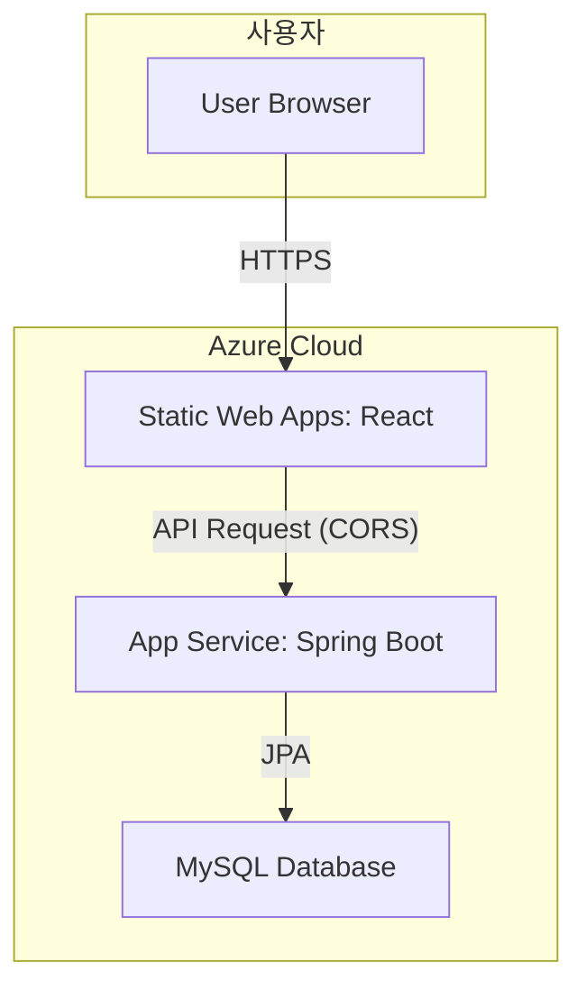

# ⚽ FC SCOUTER

**FC ONLINE 유저들을 위한 선수 정보 검색 및 데이터 분석 웹 서비스**  
선수의 상세 스탯, 실시간 시세, 팀 경력 등 다양한 정보를 API로 제공하고,  
사용자 편의 기능을 통해 상호작용할 수 있습니다.

---

## 📢 Live Demo & API

- 🌐 **웹 서비스:** [https://black-grass-0b86e0300.2.azurestaticapps.net](https://black-grass-0b86e0300.2.azurestaticapps.net)  
- 📑 **API 명세 (Swagger UI):** [https://be-fc-scouter-app-djgdgqcgeedhe4fs.southeastasia-01.azurewebsites.net/swagger-ui/index.html#/](https://be-fc-scouter-app-djgdgqcgeedhe4fs.southeastasia-01.azurewebsites.net/swagger-ui/index.html#/)

---

## 🏛️ 프로젝트 아키텍처

프론트엔드와 백엔드를 명확하게 분리하여, 클라우드 서비스에 최적화된 현대적인 웹 애플리케이션 아키텍처를 구성했습니다.

- **Frontend:** React → *Azure Static Web Apps* 배포  
- **Backend:** Spring Boot → *Azure App Service* 배포  
- **Database:** Azure Database for MySQL  

---

## ✨ 주요 기능

### 🔑 사용자 인증
- JWT 기반 회원가입, 로그인, 로그아웃

### 🔍 선수 검색
- QueryDSL 기반 동적 검색
- 이름 부분 검색, 국적/팀 경력 필터링
- 페이징 및 다중 정렬

### 📊 선수 정보 제공
- 기본 정보 및 상세 스탯
- 강화 등급, 적응도, 팀 컬러 적용 시뮬레이션
- 실시간 시세 조회 (웹 크롤링 + Spring Cache)

### 👥 사용자 상호작용
- 선수 즐겨찾기 (강화 등급 포함) 추가/삭제/조회
- 계층형 댓글 및 답글 CRUD

### 🛡️ 관리자 기능
- 댓글 삭제 권한

---

## 💻 기술 스택

---

## 💡 문제 해결 경험

### 1️⃣ 댓글 조회 시 N+1 문제
- **문제:** 댓글 + 작성자 + 답글 조회 시 1+2N 쿼리 발생 → 성능 저하  
- **해결:** `JOIN FETCH`로 연관 엔티티 한 번에 로딩 + 플랫 데이터를 계층형 구조로 변환 → **쿼리 1회로 최적화**

---

### 2️⃣ API 응답 무한 순환 참조
- **문제:** 양방향 연관관계(JSON 직렬화 시 StackOverflowError)  
- **해결:** DTO 패턴 도입 → 필요한 데이터만 응답 → 순환 참조 제거 & 응답 구조 명확화

---

### 3️⃣ 배포 환경 설정 문제
- **문제:** DB 연결 실패, CORS, 인코딩 깨짐, Timezone 불일치  
- **해결:** `Spring Profiles`(`local`, `prod`) 분리 + Azure App Service 환경 변수 적용 → 안전한 설정 관리 및 문제 해결

---

### 4️⃣ SPA 라우팅 404 에러
- **문제:** React 앱 배포 후 `/main`, `/login` 직접 접근 시 404  
- **해결:** `staticwebapp.config.json`의 `navigationFallback` 설정 → 모든 요청을 `index.html`로 rewrite → React Router 정상 동작

---
